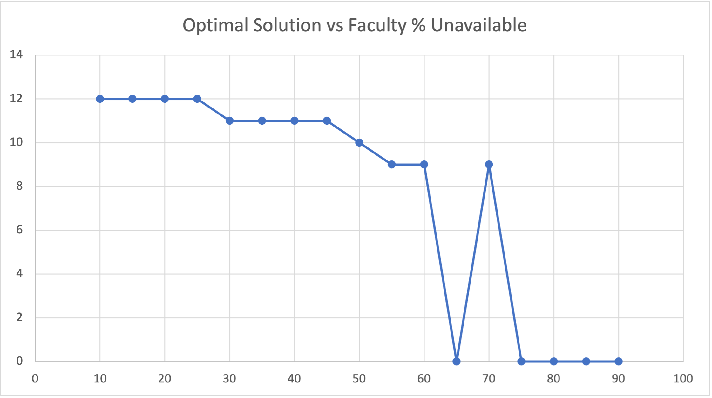

## What is this for?

This repository is an attempt to optimize the course schedule to better align faculty and student availability and standardize the scheduling process. 

## Repo Organization

**/IE_Scheduling_Parameters.xlsx** Excel file used to build parameter matrices

**/data/** Tab delimeted matrices in text format from the Excel File

**/results/** Results in md format

## How to run

1. Update parameter files using **/IE_Scheduling_Parameters.xlsx**. 

2. Copy and paste excel parameter sheets into the csv files in **/data/**. The code is setup to handle the tab delimited format. 

3. Change the model run name in **Main.java**. Run **main.java**. Output will be available in **/results/**. 

## Status of model 05/03

Model is feasible under reasonable faculty availability with all constraints listed below fully enforced. Faculty availability has been simulated with Uniform Random Distribution at varying % of periods having faculty unavailable. 

Key Shortcomings: 

    - Does not currently incorporate drills
    
    - Does not consider room availability
    
    - Does not consider faculty or student "single day load"

#### **Parameters**

$I$ = set of classes offered by dept

$J$ = set of class periods available for teaching

$S$ = set of semesters in 8 semester degree plan

$K$ = set of INEG faculty teaching in the semester

$C$ = single time period office hour capacity

$a_{ik}$ = 1 if class i taught by instructor k, o.w. 0

$d_{is}$ = 1 if class i in degree plan semester s, o.w. 0

$p_{ii'}$ = 1 if class i is prerequisite to class i', o.w. 0

$c_{ii'}$ = 1 if class i is corequisite to class i', o.w. 0

$w_{jk}$ = 1 if period j acceptable to faculty k, o.w. 0

#### **Decision Variables**

$y_{sj}$ = 1 if semester s assigned "common open period" j between classes, o.w. 0

$x_{ij}$ = 1 if class i taught during period j, o.w. 0

#### **Objective**
max $\sum^S \sum^Jy_{sj}$  (maximize common open periods between classes)

#### **Constraints**

(1) $\quad \sum^I a_{ik}x_{ij} \leq 1 \quad \forall j \in J, \forall k \in K$ (faculty can teach at most 1 class in a period)

(2) $\quad w_{jk} \geq a_{ik}x_{ij} \quad \forall i \in I,  \forall j \in J, \forall k \in K$ (faculty must be OK with teaching in a period to be assigned)

(3) $\quad \sum^I d_{is}x_{ij} \leq 1 \quad \forall s \in S, \forall j \in J$ (no class in same degree plan semester can conflict)

(4) $\quad \sum^I(0.5d_{is}x_{ij} + 0.5d_{is}x_{i,j-2}) \geq 1y_{s,(j-1)} \quad \forall s \in S, \forall j \in J$ (an open common period must be between two required courses)

(4b) $\quad y_sj = 0  \quad \forall s \in S$ where j starts or ends a day. 

(4c) $\quad \sum^J y_{sj} \geq 1 \forall s \in S \in (S \setminus 0,1,8\)$

(5) $\quad d_{is}a_{ik}x_{ij} + y_{sj} \leq 1 \quad \forall s \in S, \forall i \in I, \forall j \in J, \forall k \in K$ (Faculty must be available in the common open period)

(6) $\quad c_{ii'}(x_{ij} + x_{i'j}) \leq 1 \quad \forall i \in I, \forall i' \in I, \forall j \in J$ (prereq chain courses must occur at different times)

(7) $\quad p_{ii'}(x_{ij} + x_{i'j}) \leq 1 \quad \forall i \in I, \forall i' \in I, \forall j \in J$ (coreq chain courses must occur at different times)

(8) $\quad \sum^Sy_{sj} \leq C \forall j \in J$ (common open periods during a period j should not exceed office hours physical capacity)

(9) $\quad \sum^Jx_{ij} = 1 \quad \forall i \in I$ (all classes must be offered)
